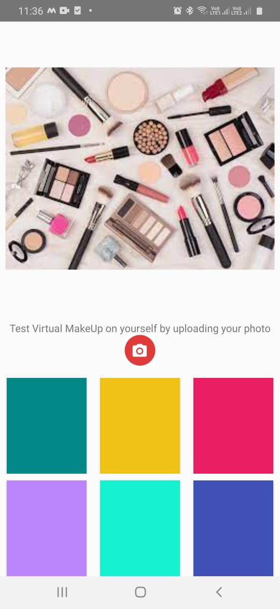
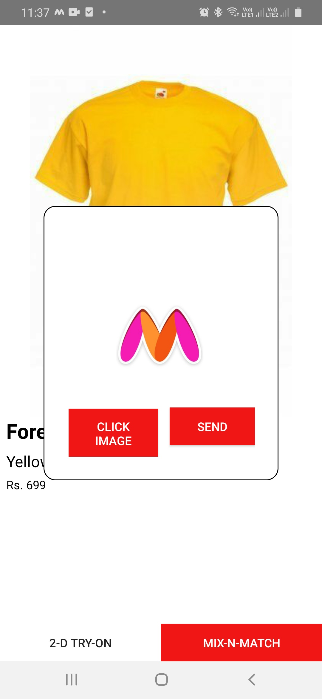

# Myntra-HackerRamp
# Team Name-Natasha
# Title- Customer Delight
## Project Description ##
Some of the common problems which customers face in online shopping are:
* While doing online shopping people do not get a fair idea of the look of the cloth. It is difficult to be sure that whether the color goes well with person’s complexion or whether the fit is appropriate with context of person’s body. 
* While buying makeup online it is very difficult to check whether it goes well with the person’s complexion, face shape and features.
So, have created a virtual try-on option application where the customer can try clothes
virtually and get a fair idea of the product. 

## Implementation ##
### Backend ###
#### Product Database ####
The data related to products available is stored on a server in the form of:
Product ID | Product Brand | Product Description | Product Price | Product Image
------------ | -------------|------------------- | --------------- | -------------
List of product ID | List of Brand | List of description | List of Price | List of Images

#### Deep Learning Model ####
The cloth virtual Try-On uses the ACGPN network. ACGPN generally involves three major modules:
* First, a semantic layout generation module utilizes semantic segmentation of the reference image to progressively predict the desired semantic layout after try-on. 
* Second, a clothes warping module warps clothing images according to the generated semantic layout, where a second-order difference constraint is introduced to stabilize the warping process during training. 
* Third, an inpainting module for content fusion integrates all information (e.g. reference image, semantic layout, warped clothes) to adaptively produce each semantic part of human body. 

The makeup virtual Try-On uses landmark detection to find points of interest on the persons face and then uses ImageDraw for applying makeup changes

### Frontend ###
The frontend is an android application whose working is as below.
* The first screen is the splash screen followed by the options screen. 

&nbsp;&nbsp;

* If the shopper selects the makeup option the next screen showing the color of makeup option opens up. The shopper clicks his image and selects the colour of makeup that he wishes to try. The image of person along with the hex code of colour is send to the landmark detection model which process the image and returns the image with the makeup done.

&nbsp;&nbsp;&nbsp;&nbsp;

* If the shopper selects the clothing option the next screen showing the available clothing option opens up. The shopper selects the cloth that he wishes to try and clicks on the try-on option.He then clicks his image and clicks on the send option. The image of person along with the link of the cloth is send to the ACGPN network which process the image and returns the image with the trial cloths worn on the persons body.

&nbsp;&nbsp;

&nbsp;&nbsp;

## Repository Details ##

* [Images](Images) contains the images of our application
* 

## Execution Details ##

* The product details database is deployed on the api:
* The model when run on google colab generates the developer api link. 
* The link for makeup model is stored in [LipSticks.java](VirtualTryOnApp/app/src/main/java/com/example/virtualtryonapp/LipSticks.java) as link/api/makeup in the variable imageUploadUrl
* The link for cloth try-on model is stored in [DetailsPage.java](VirtualTryOnApp/app/src/main/java/com/example/virtualtryonapp/DetailsPage.java) as link/api/tryon in the variable imageUploadUrl
